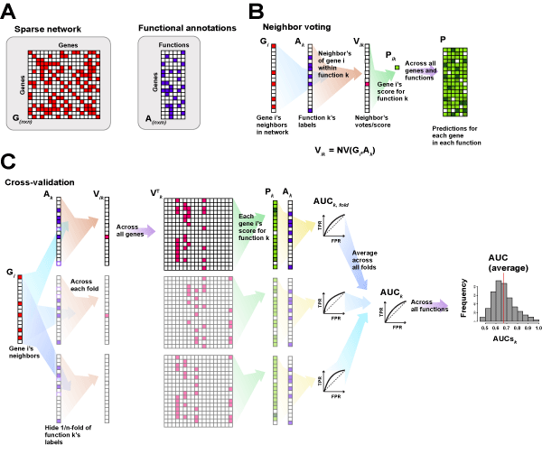
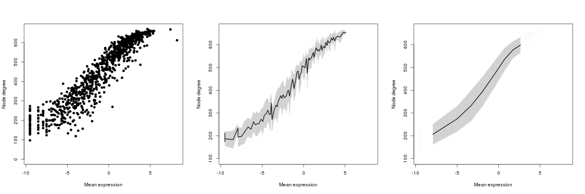
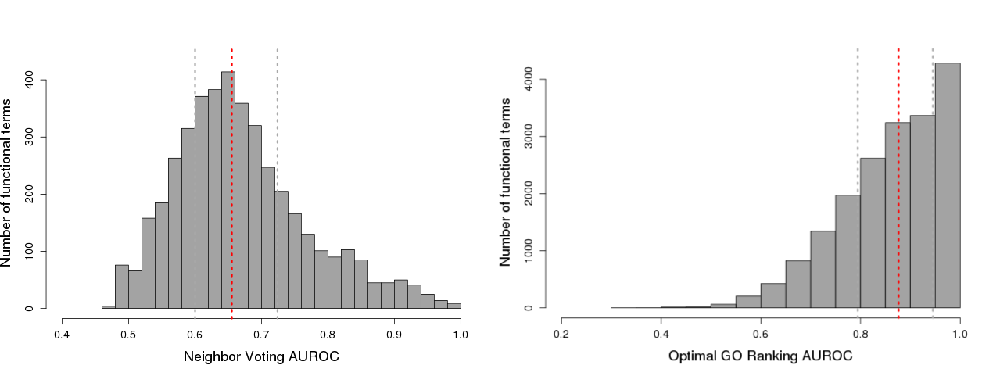
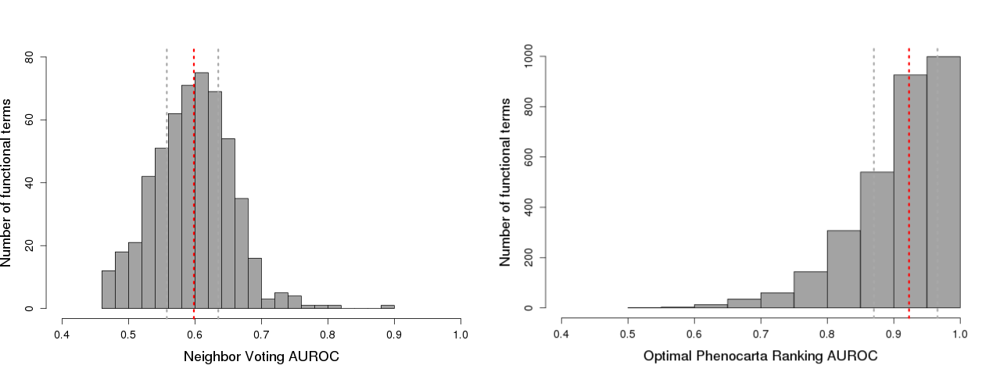
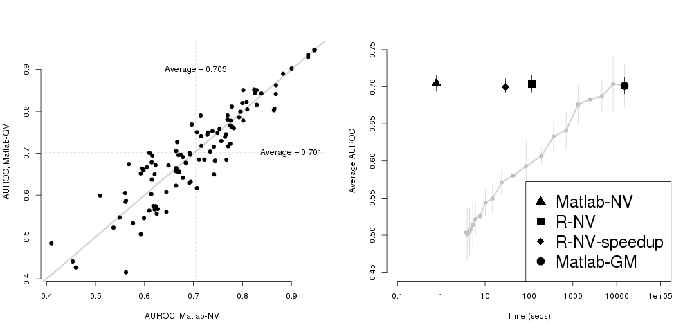
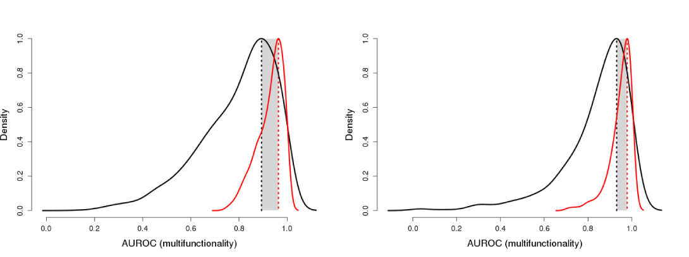

---
---
+SB and MW contributed equally

*Corresponding author

# Introduction 

This manual provides an overview of the Bioconductor package *EGAD* (Extending 'Guilt by Association' by Degree) for functional analysis of gene networks.  The package implements a series of highly efficient tools to calculate functional properties in networks based on guilt by association methods [@gillis2012gba].

## Is EGAD for you?
The principal purpose of *EGAD* is to enable gene network evaluation with respect to hundreds or thousands of gene sets. *EGAD* allows the user to determine how well the network groups known sets of genes and what genes it would predict as new members of those sets.  It also determines the degree to which mere prevalence drives predictions e.g., P53 tends to be a member of many gene sets, which makes it easier to make predictions about its function.

## Basic concepts
Gene networks are commonly used as a means of representing relationships between genes. Those relationships might be physical interactions of products, such as protein-protein interactions, or overlaps in gene activity profiles across samples of experimental data as in co-expression, where gene-gene correlations are frequently used. Because networks can represent quite different types of relationships between genes, they are a convenient common framework to integrate diverse data or to interpret data with respect to joint functional properties [@moreau2012]. Within these networks, nodes represent genes, and an edge the presence or strength (if weighted) of a relationship between a gene-pair. The fundamental principle underlying the interpretation of network data is that linked genes are more likely to share functions ('guilt by association', [@oliver2000]), providing opportunities for functional inference . Networks are often constructed with this property in mind [@kim2014].
Improving both gene networks and the computational methods for their assessment has been a major focus of research in computational biology and bioinformatics. As a result, there are now hundreds of methods available to predict gene functions or prioritize candidate genes (e.g., CAFA [@cafa2013], MouseFunc [@pena2008]). For a commentary on those methods, see [@pavlidis2012] and [@pavlidis2013]. While broadly fitting under the rubric of "machine learning", the methods used in gene network analysis may rely on fundamentally different data and employ quite disparate algorithms for interpreting that data. In other areas of bioinformatics, algorithms are distinct from data, but in network analysis, the two are often enmeshed in a single 'method'. Because these dependencies are typically opaque to end users (or even developers), it can be unclear how to interpret results or make controlled comparisons.
Our basic toolset is inspired by an observation made repeatedly in machine learning: simple methods are often surprisingly effective (Hand 2006). The methods we make available are capable of being fully vectorized and are thus orders of magnitude faster than competing implementations (e.g., GeneMANIA [@genemania2010], the top performer of the MouseFunc competition). Importantly, the methods also have comparable performance [@verleyen2015], enabling users to perform rapid, controlled comparisons and analyses.
The two core functions of *EGAD* are: a fully vectorized gene function prediction algorithm (`neighbor_voting`, `predictions`) which enables network characterization in cross-validation, even across thousands of annotation sets, in minutes; and, an analytic determination of the optimal prior to guess candidate genes across multiple annotation sets (`calculate_multifunc`, `auc_multifunc`).  The remaining functions in *EGAD* mostly serve to standardize inputs or outputs, or perform other book-keeping for the two principal methods.

### What you need to get started
The network analysis methods that are part of *EGAD* require two types of data: a network represented as a matrix, and a set-membership label represented as a binary vector. Multifunctionality assessment requires a series of such label vectors.

### A network
A network is an entity consisting of edges and nodes. We represent a network as a square matrix (G), called an adjacency matrix. In this representation of a network, each row and column indicates a node, and the connection between the two is indicated by the corresponding entry in the matrix. For a sparse network, an edge has a value of 1 if there is a connection between the nodes, or 0 otherwise. In a dense and weighted network, we standardize the edges so that their weights range from 0 to 1; values close to 0 are weaker connections and those close to 1 are stronger connections.  A protein-protein interaction network would look much like the sparse network (**Figure 1**) with an interaction flagged as a 1; whereas a co-expression network, generated from gene expression profile correlations and standardized, would be dense and weighted.


<figure align="center">
<figcaption>  
Figure 1. Different forms of network representation. Networks are thought of as graphs, but they can be represented as a matrix, with entries for each edge. Binary networks, or sparse networks, can be represented with entries marked as 1 or 0. Weights can also be used to indicate the strength of the relationship. </figcaption>
</figure>

&nbsp;


### An annotation set-label vector
We represent a set of nodes as a binary vector; each entry in the vector corresponds to a node, with a 1 indicating that the node is a member of the set, and a 0 if it is not. For example, the cell cycle pathway might generate a label vector as shown in the figure below (Figure 2).  All gene ontology terms can be represented as a matrix (i.e., a series of these vectors) where each column is a different GO function.  We refer to the genes labelled by each GO function as an annotation set.


<figure align="center">
<figcaption> 
Figure 2. Attributes or annotations. A label vector indicates a given set of nodes with each node labeled as belonging (1) or not (0).  These can be combined into a matrix of such labels, so that each column is a function, and each row the gene.
</figcaption>
</figure>

### What you can do with this package

The functions implemented in *EGAD* can be applied to networks constructed from a range of data types (e.g., protein-protein interactions, expression levels) across a variety of species with available gene function annotation sets (e.g., human, mouse, zebrafish, worm, fly and yeast). **Figure 3** outlines the objects and workflow included in this package which we go into more detail in the next sections. In particular, this package allows users to:

* Generate binary and weighted gene-gene networks from different data sources

* Extend a binary network into a weighted network through indirect connections

* Analyze network topology

* Perform fast, functional analysis of a network using neighbor voting in cross-validation [^1]

* Quantify selection bias in a network

* Perform gene function prediction and assessment

* Assess multifunctionality of nodes with a given set of attributes or annotations [^1]

[^1]: Matlab implementation of these methods is also available online at https://github.com/sarbal/EGAD.


<figure align="center">
<figcaption> 
Figure 3. Workflow and available functionality in *EGAD*. The two main objects used are networks and set annotations (labels). The two necessary objects required for using *EGAD* are a network matrix and an annotation vector or matrix. We assess the network independent of the annotations through its topology, and the annotations through gene multifunctionality calculation. The network functional assessment, which we cover in the core functions workflow (here termed classification), requires both the network and the annotations. More details in the upcoming sections.
</figcaption>
</figure>


## What is in this user guide
This manual contains descriptions and usage examples of the network analysis functions in *EGAD*. First, we describe a simple and efficient algorithm for function prediction from gene networks, and then a method for the assessment of multifunctionality bias within networks. We then comment on data resources and describe the preprocessed data sets included in the package. The final sections of the manual contain a detailed user guide that walks the reader through relevant use cases.

In addition to demonstrating standard workflows of *EGAD*, we want to show the broad applicability of the package and point out bioinformatic and network-analytic issues that originally motivated its development. For this, we included two case studies on topical questions in biological network inference. Firstly, we used *EGAD* to trace the effects of selection biases arising from the transfer of function predictions from human genes to orthologs in model organisms. This contributes to the ongoing debate about the usefulness of model organisms for ascertaining disease-causing genes in complex genetic disorders. Secondly, we demonstrate the value of dense gene networks, in combination with the neighbor voting algorithm, for gene function prediction. The second case study demonstrates how important technical biases can significantly influence the credibility of predictions obtained from gene network inference.

Lastly, our coda describes the design philosophy behind *EGAD*.

## Citations
This software package was developed and is maintained by the Gillis lab at the Stanley Institute for Cognitive Genomics at Cold Spring Harbor Laboratory, building on prior work of the authors. Please try to cite the appropriate articles when you publish results obtained using the software. The *EGAD* package implements methods from the following publications:

### When using the optimal prior calculation or multifunctional gene assessment

**Gillis, J. and P. Pavlidis, The impact of multifunctional genes on "guilt by association" analysis. PLoS One, 2011. 6(2): p. e17258.** 

* This paper explains that a large part of gene function prediction is driven by multifunctional genes, and not the specific relationships in the network. It proposes the use of controls that can provide more meaningul estimates for performance, and an analytic calculation of gene multifunctionality.

### When using the neighbor voting algorithm for analysis

**Gillis, J. and P. Pavlidis, The role of indirect connections in gene networks in predicting function. Bioinformatics, 2011.**

* The work explains the performance of gene function prediction algorithms in exploiting network structure. It argues that using simpler algorithms (such as neighbor voting GBA) but more information dense data are equal if not better than the reverse (complex machine learning methods and sparse data).

### Other useful cites

**Gillis, J. and P. Pavlidis, "Guilt by association" is the exception rather than the rule in gene networks. PLoS computational biology, 2012. 8(3): p. e1002444** 

**Pavlidis, P. and J. Gillis, Progress and challenges in the computational prediction of gene function using networks. F1000. Vol. 1. 2012.** 

**Pavlidis, P. and J. Gillis, Progress and challenges in the computational prediction of gene function using networks: 2012-2013 update. F1000.Vol. 2. 2013.**

## How to get help
Hopefully, most questions can be answered by the documentation or the references cited. If not, problems and questions regarding *EGAD* should be posted to the Bioconductor support site https://support.bioconductor.org. The authors appreciate receiving reports of bugs in the package functions or in the documentation. Please send requests for general assistance and advice to the support site rather than to the individual authors. The authors are open to hear suggestions for improvements and will try to answer any requests in a timely manner.

## Installation
To install this package, start R and enter

```{r, eval=FALSE}
<<<<<<< HEAD
if (!require("BiocManager"))
    install.packages("BiocManager")
BiocManager::install("EGAD", version = "devel")
=======
## try http if https is not available
if (!requireNamespace("BiocManager", quietly=TRUE))
    install.packages("BiocManager")
BiocManager::install("EGAD")
>>>>>>> upstream/master
```
To view this documentation in R, enter
```{r, eval=FALSE}
browseVignettes("EGAD")
```

---
---

------

---
---
# Package Overview

In this section we give an overview of the core functions and main features of the *EGAD* package. For usage and applications see the examples in the following sections. In addition, concise examples are included in the function documentation.

## Load the package in R

```{r library, results="hide"}
library(EGAD)
```

## Data resources
For demonstration purposes, the package includes preprocessed protein-protein interaction data from the BIOGRID database (`biogrid.RData`)[@biogrid2006], a parsed and propagated function-gene ontology from the Gene Ontology (`GO.human.RData`) [@ashburner2000],[@GO2015] and a parsed disease-gene ontology from Phenocarta (`pheno.RData`)[@phenocarta2013]. 

BIOGRID was downloaded on 30/07/2015. We only included human data and filtered for physical interactions. The resulting preprocessed data set contains 211,506 pairs of interacting genes. They are labeled with Entrez IDs. GO (version: 12/12/2014) provides classifications into 19,003 GO groups for 18,402 genes (multiple assignments included). Both gene names (column 1) and Entrez IDs (column 2) are contained in the data set. We also provide a GO version for mouse (version: 12/12/2014,  18,321 groups for 18,813 genes). Phenocarta contains labels for 9,626 human genes (Entrez IDs) with respect to 3,028 diseases. The version provided here was downloaded on 08/27/2015.

We also provide functions to get the latest versions of these data sets, detailed in the next section.


## Tools for gene network analysis and gene function prediction

### Core function: Neighbor voting for gene function prediction
The function `run_GBA` provides a fully vectorized method for evaluating functional properties of an interaction network. It performs a gene function prediction algorithm (`neighbor_voting`) based on the "guilt by association" principle: genes with shared functions (i.e., within the same annotation set) are preferentially connected. Hiding a subset of gene labels, we ask if the remaining genes in the annotation set can predict the hidden genes' identities using information inferred from the network.

As a performance metric, we chose the AUROC (i.e., the area under the ROC curve) for each function or annotation tested. It corresponds to the probability that we will correctly predict a gene's label if one of two genes has a positive label. Analytically calculated for the sake of computation time, this metric broadly reflects how well the genes in the network align with the given annotation. The prediction algorithm works on the idea that neighborhoods within the network contain highly interconnected nodes. Genes with similar neighbors are likely to share common properties, giving rise to a prediction metric based on the similarity of neighbors. Perfect predictability corresponds to an AUROC of 1, whereas scores close to 0.5 indicate data with low information-content, comparable to randomly generated data.  Thus, high AUROCs for a given gene set indicate that genes within that gene set preferentially have one another as neighbors.

The neighbor voting method takes a gene network and a set of annotations (gene label vectors) as input, and outputs prediction scores for each of the annotation sets, as well as the performance metric of the network. The average performance is the average AUROC across all annotation sets.
We also provide a prediction-only version of the neighbor voting method (`predictions`), that waives cross validation in favor of making predictions based on the whole set of interactions. Even for large network sizes (e.g., 10K nodes with hundreds of functional groups) the code runs within several minutes. See **section 3.3** for detailed information on computation times.
The package also contains Matlab implementations for both functions (`voter.m` for `predictions` and `voter_ROC.m` for `neighbor_voting`).



<figure align="center">
<figcaption>  
Figure 4. A schematic of guilt by association. (A) The input required (B) A simplified representation of the neighbor voting calculation for a prediction, where the scores for each gene are a function of the connections of that gene and the genes annotated in that gene set. (C) A simplified representation of the cross-validation steps, with the vectorization. Here we show it split into three individual calculations, but the steps are all performed on two large matrices at once.
</figcaption>
</figure>


An additional assessment of the network that is performed is a node degree analysis. Genes with many edges in the network have high node degrees, and will tend to be associated with many annotation sets. To measure the degree to which this is true, we calculate the node degree AUROC.  We rank genes according to their node degree and use that single vector as a prediction for each annotation set, from which we calculate an AUROC. We call this a node degree bias as it demonstrates the predictability of the gene in the group tested solely due to its total number of connections in the network rather than its preferential connectivity to other genes within the annotation set. We have found that it is a useful control when we compare these scores to the neighbor voting performance AUROC.


### Core function: Multifunctionality assessment
The second core function, `calculate_multifunc`, evaluates gene function prediction based on frequency of annotations.  As is the case of the node degree AUROC, this is not intended as a true "prediction", but a measure of the degree to which a given bias could explain performance.  It constructs the single list that gives the highest average AUROC across all functions. More colloquially, this function attempts to 'cold read' the data and makes the best guess that would work for every annotation set. If it performs well, it indicates that the prevalence of annotations varies strongly between genes. The more highly annotated, or multifunctional, a gene is, the higher the chances it will be predicted as a good candidate for having any annotation, rendering its prediction correct but uninformative. We call this the multifunctionality bias. To determine how this affects gene predictions, we provide a method to analytically determine the optimal prior for guessing candidate genes across functional groups in a given ontology. In combination with the function auroc_analytic, the generated optimal list can be used to determine multifunctionality scores. A comparison of those values with the neighbor voting performance AUROCs gives an indication of the degree to which generic predictions dominate results. Often, as in the example we give below (**section 4.1**), this will arise due to selection biases, which make certain subsets of genes 'good' general predictions.


<figure align="center">
<figcaption>  
Figure 5. A schematic of the multifunctionality calculation and assessment. See [@gillis2011mf] for more details on the MF score calculation.  The score takes into account the genes annotated to (nk) and not to (n'k) the gene set for each functional group Ak.
</figcaption>
</figure>

&nbsp;

`calculate_multifunc` is a fully vectorized function that runs within seconds on even large annotation sets, such as those provided in conjunction with GO. A corresponding implementation in Matlab is available (`opt_ROC.m`).

### Getting gene annotation and functional data
Gene labels (annotations) are necessary input for both core functions of this package. Typically, they correspond to a given function (e.g., the GO carbohydrate catabolic process), a known pathway (e.g., the KEGG mTOR signaling pathway), a disease (e.g., candidate genes for autism spectrum disorder from SFARI), or a gene set (e.g., the postsynaptic density genes). The labels define functional groups represented in an annotation matrix, where rows correspond to genes and columns to the respective groups. Associations between genes and groups are indicated by an entry of 1 in the matrix, otherwise we set the entry to 0.
The absence of a group annotation may indicate that a gene has not been tested for inclusion in the group (i.e., new genes or genes with unknown functions), but we do not make a distinction at this level.

#### From Phenocarta
Phenocarta is a resource of gene-disease annotations from a variety of databases ranging from OMIM, to the NIH GWAs catalog and from a wide range of disease-specific databases.
To get the latest data:
```{r eval=FALSE}  
data <- get_phenocarta(species="human", type="all")
```
#### From BIOGRID
BIOGRID is a curated database of protein-protein interaction data for many species, built using various experimental techniques such as affinity-capture mass-spectrometry and yeast-two hybrid screens.

To get a particular data type for a known species (such as human) use:
```{r eval=FALSE}          
data <- get_biogrid(species="9606")
```
Or for a given version:
```{r eval=FALSE}   
data <- get_biogrid(species="9606", version="3.4.131")
```

#### From GEO
GEO (Gene Expression Omnibus [@geo2002]) is a large compendium of raw and parsed expression data.
```{r eval=FALSE}        
exprs <- get_expression_matrix_from_GEO(gseid="GSE34308")
```
#### From Gemma
Gemma is a curated resource of parsed expression and co-expression data [@gemma2012]. Expression sets can be downloaded manually from the site (http://www.chibi.ubc.ca/Gemma/home.html) or imported through our function.

```{r eval=FALSE}        
exprs <- get_expression_data_gemma(gseid="GSE34308", filtered = "true")
```
#### Other data sets
In principle, any data set that indicates a gene-phenotype relationship can be analyzed with *EGAD*. For this, the data can be read into the R session as tables, preprocessed such that the first column represents gene IDs and the second the associated phenotype, function or label. Users could also use KEGG or MolSigDB as interesting gene sets for their analysis.

### Parsing gene data into gene annotations
To convert the gene annotation matrices into R objects, we have developed a set of functions to parse the data. For most functions, we use binary matrices in which 1s and 0s indicate associations between a gene (represented in a row) and an annotation (represented in a column).

#### Getting gene lists
The NCBI Entrez gene IDs are used throughout in order to standardize and constrain our analyses. Other gene IDs should be converted to their corresponding Entrez IDs. 


#### Constructing gene annotations
For the vectorized calculations in the analyses, we need a standardized list of genes and annotations in the binary matrix format. We provide a function to convert a gene-to-annotation list into the binary matrix. Given a gene-to-annotation paired list (geneToAnnotation), a list of genes (genelist, an array of gene ids) and an associated function (annotationlist, an array of annotations), we generate an annotations matrix for use in the analysis through:

```{r eval=TRUE}  
data("example_annotations")
annotations <- make_annotations(example_annotations$gene2Annot, 
                                example_annotations$genes, 
                                example_annotations$annotationlist)
head(colnames(annotations))
```

### Building networks
We define networks as undirected graphs, where nodes represent genes and edges the relationship between a pair. In binary networks, edges are either 1s or 0s, indicating whether or not a relationship exists between the adjacent nodes. Binary networks are often sparse, which comes in handy when analyzing large data sets by reducing parts of the algorithm to sparse matrix operations, significantly decreasing the computation time. In a fully dense weighted network every edge has a weight, which incorporates additional information about the strength of the node relationship. A weighting function assigns a value between 0 and 1 to each edge. *EGAD* includes a set of functions to build each network type from different data sources.

#### Binary networks from protein-protein interaction or other data
To generate a binary network from protein-protein interaction data, you need a list of gene interaction pairs, and the gene list you want to constrain your network to.

```{r eval=TRUE}  
data("example_binary_network")
binary_net <- build_binary_network(example_binary_network$genepairs, example_binary_network$genelist)
hist <- plot_distribution(node_degree(binary_net), b=10, 
                          xlim=c(0,14), ylim=c(0,2), xlab="Node degree")
```

#### Extending binary networks
Taking not only direct, but also short-path connections between nodes into account, we can extend sparse binary networks through indirect connections [@gillis2011ind]). For this, we calculate the shortest path length between two nodes using Dijkstra's algorithm [@dijkstra1959]. The inverse of this length can be used as a weight between any two nodes. Edges that represent direct connections then have weight 1 (path length of 1). Nodes that can be connected through a single other node have a weight of 0.5 (path length 2), those with 2 are at 0.33 etc. In *EGAD*, we used the igraph package functions to calculate path lengths, and then extend the binary network:

```{r eval=TRUE}        
extended_net <- extend_network(binary_net)
hist <- plot_distribution(node_degree(extended_net), b=10, xlab="Node degree", )
```

#### Semantic similarity networks using Jaccard
Another popular form of gene networks are semantic similarity networks, where the weight of an edge is the similarity of two genes with reference to a set of annotations. In this case, a known set of annotations or labels are used to build vectors for each gene, and the Jaccard index is used to calculate the edge weights. The Jaccard index measures the distance between the two feature vectors associated with the nodes. In this case the vectors represent the functionality of the considered pair of genes. Annotations can be taken from data bases like the Gene Ontology (GO) or a set of predefined terms curated from the literature.
```{r eval=TRUE}        
semantic_net <- build_semantic_similarity_network(annotations, example_binary_network$genelist)
hist <- plot_distribution(node_degree(semantic_net), b=20, xlab="Node degree", bars=TRUE)
```

#### Co-expression networks from expression data
Co-expression networks are another common gene network resource. Gene expression profiles are measured across many samples and are used to generate correlation coefficients for gene pairs. These are then used as edge weights within the network. The resulting networks are generally dense, but can be thresholded to remove spurious or noisy edges. We recommend using 100s to 1000s of samples, and Spearman correlations for calculating correlation coefficients.
Expression data can be obtained from GEO to build co-expression networks based on individual experiments that are either expression sets from the Biobase package or a matrix of expression data:

```{r eval=FALSE}
data("example_coexpression")
coexp_net <- build_coexp_expressionSet(exprsSet, genelist, method="spearman", flag="rank")
# or 
coexp_net <- build_coexp_network(exprs, genelist, method="spearman", flag="rank")
```
In both instances, the column names should match the names of the samples, and the row names the gene Entrez IDs.

### Running the neighbor voting algorithm

#### Neighbor voting
The function `neighbor_voting` requires a gene network and a set of gene labels. There are two implementations of this method with different statistical measures, one with AUROCs, and one using precision-recall accuracies.
```{r eval=TRUE}
data("example_neighbor_voting")
network <- example_neighbor_voting$network
gba_auc_nv <- neighbor_voting(annotations, network, nFold=3, output="AUROC")
# or 
gba_pr_nv <- neighbor_voting(annotations, network, nFold=3, output="PR")
head(gba_auc_nv)
head(gba_pr_nv)
```

### Running the multifunctionality assessment analytically
As a control for the annotations used in the neighbor voting algorithm, we construct optimal lists through an analytic calculation as in [@gillis2011ind].

#### Calculating multifunctionality using annotations
This function takes in the gene annotations and outputs a ranked score for each gene. Using these ranked scores, an optimal AUROC is calculated.
```{r eval=TRUE} 
multifunc_assessment <- calculate_multifunc(annotations)
auc_mf <- auc_multifunc(annotations, multifunc_assessment[,4])
hist <- plot_distribution(auc_mf, xlab="AUROC", med=FALSE, avg=FALSE)
```

### Plotting results
We implement a few functions that are useful visual tools for these analyses.

#### Scatterplots and smoothed plots
Data can be displayed as simple scatterplots, but more instructively, in a smoothed plot. Here, we convolve the x and y data points over a defined window size, and draw the standard deviation around it in grey.
```{r eval=TRUE} 
X <- runif(1000)
Y <- runif(1000) + X*0.3
window <- 50
smoothedxy <- conv_smoother(X,Y, window, xlab="X",ylab="Y")
```

As another example: 


<figure align="center">
<figcaption>  
Figure 6. Varying windows of smoothed scatter (0,10,100) showing the mean expression of genes (x-axis) versus their node degrees (y-axis) for an example co-expression network.
</figcaption>  
</figure>

#### Distributions
The simplest way to display the AUROC results is to plot the distribution, either on its own (**Figure 7A**) or in comparison to predictions made using node degree alone (**Figure 7B & C**).

With toy data: 
```{r eval=TRUE}
filt <- !is.na(gba_auc_nv[,1])
aucA <- gba_auc_nv[filt,1]
aucB <- gba_auc_nv[filt,3]
hist <- plot_distribution(aucA, xlab="AUROCs")
avgs <- plot_density_compare(aucA, aucB, xlab="AUROCs")
plot_value_compare(aucA, aucB)
```
With real data: 


<figure align="center">
<figcaption> 
Figure 7. AUROC distributions and comparisons. (A) Distribution of AUROCs from the neighbor voting algorithm to show the mass of values, with a small tail. (B) The smoothed distributions comparing the neighbor voting AUROCs (black line) and the node degree AUROCs (red line). The modes are drawn as dashed lines, and the grey box highlights the distance between them. (C) A scatterplot of the two AUROC distributions, with the identity line in grey, and the red lines showing the means.
</figcaption>
</figure>

#### ROC plots and overlay plots
The AUROCs are calculated analytically within the neighbor voting algorithm, but additionally we provide functions to draw the true positive rate (TPR) and false positive rate (TPR) of the ROC curve (see next section for functions). We provide an ROC plotting function that draws an individual ROC curve for an annotation set given the scores and the labels for that annotation set. Or, for the performance results across all annotations sets, an overlay plot helps show the average performance and the underlying distribution of curves.
```{r eval=TRUE, include=FALSE}
scores <- 100:1 
labels <- sample(c(0,1), 100, replace=TRUE)
labels[1:13]<-1
labels[18:30]<-1
```

```{r eval=TRUE} 
roc <- plot_roc(scores, labels)
```

Here we demonstrate on the prediction results.
```{r eval=FALSE} 
scores <- predictions(labels, network)
plot_roc_overlay(scores, labels)
```


<figure align="center">
<figcaption> 
Figure 8. ROC overlay of 3-fold cross-validation of 101 functions (bin size 500) across 14626 genes.
</figcaption>
</figure>

&nbsp;

### Other functions

#### ROC curves and AUROCs
To generate the ROC curves for predictions scores for a given annotation matrix (labels), we calculate false positive rates (FPR) and true positive rates (TPR) for a ranked list of scores:
```{r eval=TRUE} 
roc <- get_roc(scores, labels)
```
And calculate the area under the curve (AUROC) through an approximation:
```{r eval=TRUE} 
auroc <- get_auc(roc[,1], roc[,2])
print(auroc)
```
Or analytically (see Supplemental Material of [@gillis2011mf]):
```{r eval=TRUE} 
auroc <- auroc_analytic(scores, labels)
print(auroc)
```

#### Precision-recall curves
To calculate precision-recall values use:
```{r eval=TRUE} 
prc <- get_prc(scores, labels)
prc <- plot_prc(scores, labels)
```

For the area under the precision-recall curve use:
```{r eval=TRUE} 
auprc <- auprc(scores, labels)
print(auprc)
```
And for the F-Beta measure:
```{r eval=TRUE} 
fbeta <- fmeasure(prc[,1], prc[,2], beta=1)
```
#### Network topology measures
The distribution of node degrees is a measure for the connectivity in the network. For each node, the degree is defined as the number of edges it is adjacent to.
```{r eval=TRUE} 
nd <- node_degree(network)
hist <- plot_distribution(nd, xlab="Node degree", med = FALSE)
```

Another important topological measure is assortativity, defined as the preference for nodes to attach to similar nodes within a network. It ranges between 0 and 1, with highly assortative networks (cliquey) close to 1, and uncorrelated networks closer to 0.
```{r eval=TRUE} 
assort <- assortativity(network)
print(assort)
```
---
---

------

---
---

# User Guide

## Using EGAD to evaluate protein-protein interactions with GO
This user guide walks through the workflow of a quick analysis for evaluating a protein-protein interaction network using gene labels from GO.


### Prepare data
We begin by loading the data into the R workspace. Both `biogrid.RData` and `GO.human.RData` are preprocessed data examples included in this R package, but other data may be used.
To construct the network, load the set of interacting pairs from BIOGRID and an ontology of choice (e.g. Gene Ontology). 

```{r eval=FALSE}
data("biogrid")
data("GO.human")
```
### Build interaction networks (e.g., gene-by-gene matrix)
Using the pairs of genes, extract a list of all the occurring genes. Then, build the interaction network using the gene pairs and the gene list.
```{r eval=FALSE} 
genelist <- make_genelist(biogrid)
gene_network <- make_gene_network(biogrid,genelist)
```

### Build annotation matrix
The next step is to build the annotation matrix using the list of all occurring genes (genelist) and the respective subset of annotation terms (goterms).This matrix should be sparse and binary, with entry 1 if the gene (rows) is associated with the respective functional groups (columns) and 0 otherwise.
```{r eval=FALSE} 
annotations <- make_annotations(GO.human[,c(2,3)],genelist,goterms)
```

### Run neighbor voting
Using the binary gene network from BIOGRID and the GO annotations as input, we can run the neighbor voting algorithm.
```{r eval=FALSE}
GO_groups_voted <- run_GBA(gene_network, annotations)
```
To analyze node degree biases it is useful to evaluate the correlation between node degree ranks and ranks in terms of the number of annotated GO groups per gene. Use `run_GBA` to obtain node degree ranks and create ranked lists as shown above. For GO term ranks use `calculate_multifunc` (see example below).

### Run multifunctionality assessment for the ontology used
We perform the multifunctionality assessment using the GO annotations:
```{r eval=FALSE} 
GO_multifunc_assessment <- calculate_multifunc(annotations)
```

### Create optimal lists
Once gene scores are calculated, we can use them as means for functional predictions.
```{r eval=FALSE}
# For genes
ord <- order(as.numeric(GO_multifunc_assessment[,2]),decreasing=TRUE)
GO_multifunc_assessment_s <- GO_multifunc_assessment[ord,c(1,2)]
optimallist_genes <- as.vector(unlist(GO_multifunc_assessment_s[,1]))

# and for GO groups
ord <- order(as.numeric(GO_groups_voted[[1]][,2]),decreasing=TRUE)
GO_groups_voted_s <- GO_groups_voted[[1]][ord,]
optimallist_GO <- cbind(GO.term=rownames(GO_groups_voted_s), 
                    node.degree=GO_groups_voted_s[,2], roc=GO_groups_voted_s[,1])
```

### Use optimal lists to determine multifunctionality AUROC
```{r eval=FALSE}  
auc_GO_mf <- auc_multifunc(annotations, optimallist_genes)
```

### Visualize results
We give examples for visualizing results for two commonly used ontologies (human): the Gene Ontology 'GO' (`GO.human.RData`) and Phenocarta (`pheno.RData`).

#### Gene Ontology
To visualize the distribution of neighbor voting AUROC scores over all GO groups (calculated by running `run_GBA`), use
```{r eval=FALSE} 
auc_GO_nv <- GO_groups_voted[,1] 
plot_distribution(auc_GO_nv, xlab="Neighbor voting AUROC ", 
                  ylab="Number of functional terms",
                  b=30, xlim=c(0.4,1), ylim=c(0, 440), col="gray64", 
                  density=FALSE, avg=FALSE, bars=TRUE)
```

This code also plots the statistical properties of the distribution (red: median, grey: inter-quartile ranges) and incorporates them in the figure. Similarly, the distribution of multifunctionality AUROCs (use `calculate_multifunc` and `auc_multifunc`) can be visualized:
```{r eval=FALSE} 
plot_distribution(auc_GO_mf, xlab="Optimal GO Ranking AUROC",
                  ylab="Number of functional terms",
                  b=20, xlim=c(0.2,1), ylim=c(0,4400), col="gray64", 
                  density=FALSE, avg=FALSE, bars=TRUE)
```


<figure align="center">
<figcaption> 
Figure 9. Distribution of AUROC scores. Left panel: for neighbor voting using GO groups sized 20-1000 genes as the annotation sets. Right panel:  for multifunctionality assessment using all GO groups as the annotation sets.
</figcaption>
</figure>


#### Phenocarta
In the previous sections we walked through a complete analysis using GO. The syntax can be used for any gene annotations including the Phenocarta. Here we provide visualizations of the results when running the analysis using Phenocarta annotations.


<figure align="center">
<figcaption> 
Figure 10. Distribution of AUROC scores. Left panel: for neighbor voting using all of Phenocarta  defined diseases as the annotation sets. Right panel:  for  multifunctionality assessment using all of Phenocarta  defined diseases as the annotation sets.
</figcaption>
</figure>


## Using EGAD to generate and analyze dense co-expression networks
Further to using binary and sparse networks, *EGAD* can analyze dense networks quickly due to the vectorized form of the algorithm. Here we go over the basic steps to generate and analyze a dense co-expression network.

### Prepare data
We begin by loading in the data and only selecting protein coding genes with Entrez IDs. We generate a co-expression network from accessible expression data (see below). ExpressionSets from the biobase package can be used here instead of the R matrix object, or users may load their own data as an R matrix.
```{r eval=FALSE} 
data("attr.human")
genelist <- unique(attr.human$entrezID[attr.human$type == "protein_coding" 
                & !is.na(attr.human$entrezID)] )
exprs <- get_expression_matrix_from_GEO("GSE34308")
```

### Build co-expression network
Once the expression data is in the correct format (genes as rows, samples in columns), or if using the expressionSet object, we can build the network. By default, Spearman correlation coefficients are used to define edge weights then the network is ranked and standardized.
```{r eval=FALSE} 
network <- build_coexp_network(exprs, gene.list)
network <- build_coexp_expressionSet(exprsSet, genelist)
```

### Calculate and visualize network topological properties
We calculate the assortativity of the network through the assortativity function. The node degree of the genes is a useful topological property that can be extracted and visualized by plotting the density. 
```{r eval=FALSE} 
assort <- assortativity(network)
nd <- node_degrees(network)
plot_density(nd)
```

### Run neighbor voting
As in the previous example, we need a gene annotations matrix to get started. In this case, if we want to use sets between 20 and 300, we would first filter the annotations object before running the analyses. 
```{r eval=FALSE}  
data("GO.human")
annotations <- make_annotations(GO.human[,c(2,3)],genelist,goterms)
annotations_sub <- filter_network_cols(annotations, min=20, max=300)
GO_groups_voted <- run_GBA(network, annotations_sub)
```

## Run times and comparative performance
Next, we provide reference values for the running times of the core functions. As mentioned above, the package contains implementations in R and, for the core functions, additional versions in Matlab. The corresponding computing times are included below, allowing for comparison of efficiency across languages that might be taken into account when designing studies on large data sets. Speed-ups are also possible with parallelization and installing libraries such as MRAN (https://mran.revolutionanalytics.com/).

### Neighbor voting
The `neighbor_voting` algorithm implements gene function prediction in a fully vectorized manner, enabling one to perform studies on large data sets in a reasonable amount of time. For reference, we ran the algorithm (in R) on a dense co-expression network (17,293 genes) across GO groups of size 20 (104 terms passed this filter). This took well under 2 minutes on our server (8 CPU cores @ 2.40GHz), even without MRAN. Our same implementation in Matlab took under a second; the Matlab implementation of GeneMANIA took a few hours. The GBA performances of these algorithms is comparable (**Figure 11A**), yet the speed increase is well over 100 fold (**Figure 11B**).  We also compared the performance to a speed-up when using the MRAN package, and obtain an expected speed-up (to approximately 30 seconds).

As another comparison, we looked at the performance of GeneMANIA on sparsified networks (grey lines and points in **Figure 11B**). Networks were sparsified following a thresholding $(1/2)^n$ geometric series (i.e., half the values set to zero, then three quarters, etc). While increasing sparsity improves the speed of GeneMANIA, it is at the cost of performance.


<figure align="center">
<figcaption> 
Figure 11. Performance of the vectorized version of the neighbor voting (NV) algorithm compared to GeneMANIA (GM). (A) For the 104 GO terms tested, the performance AUROCs of each method are highly correlated (0.9). (B) The speed increase, however, is significant. Each black point represents the average performance across the GO groups (with the SD). The grey points are the average performances as the network is thresholded at 50%, 75%, etc. for GM. Although there is a speed increase for the sparsest network, all performance is lost (AUROC~0.5). The R implementation is also faster than GM, and can be sped up substantially with other packages.
</figcaption>
</figure>

---
---

------

---
---
# Case Studies
After a step-by-step guide on the core functions and general use of the package, we want to give some general examples for current issues in genomics research that can be tackled using *EGAD*. These case studies are basic demonstrations and applications of the methods, and can be expanded in much greater depth. We leave this for further work.

Our first case study is intended to highlight the application of multifunctionality assessment. In it, we assess possible selection biases in assigning genes functions based on model organism studies. Our second case study demonstrates the value of neighbor voting in rapidly and comprehensively assessing global changes in a network. In that analysis, we assess the performance improvement resulting from the inclusion of indirect connections (i.e., neighbors of neighbors) in protein-protein interaction networks.

## Selection biases in the use of model organisms to learn gene function

### Background
When studying possible genetic causes for complex disorders in humans, many researchers perform experiments using model organisms, such as the common house mouse (Mus musculus [@rosenthal2007]), zebrafish (Danio rerio [@zfin2003]), worms (Caenorhabditis elegans [@kaletta2006]) or yeast (Saccharomyces cerevisiae [@tenreiro2010]). These rely on the assumptions that the genes of interest for the disorder are present in both humans and the respective model organism, and that gene function is conserved. This latter assumption can be hard to validate, making it difficult to transfer functional information from one species to another [@drake2013]. Recent conflicting outcomes in studies using the same data impose considerations on more integral questions, in particular the methodology used to map genes between species (e.g., see [@seok2013; @takao2015; @gilad2015]). In some instances, only homologs are considered, and in other cases, only genes that are annotated. These choices are also limited by the species, as some organisms are better annotated than others.

In order to study these issues, we consider how well a protein-protein interaction network predicts gene function but we assume that all information about gene function is being learned from some model organism. This limits discoveries to the set of genes shared between the two organisms, and thus creates a selection bias; the subset of genes without orthologs are now bad candidates for all functions. This should be revealed by multifunctionality assessment since it solely exploits variability in the prevalence of gene annotations.  Thus, we expect the performance of the multifunctionality prediction to rise steadily as we move to more and more distant organisms.

### Methods
We apply the neighbor voting algorithm on a human protein-protein interaction network, constraining our label sets to a subset of annotated orthologous genes. As the organism gets further and further from human in evolutionary time, the subset of genes considered gets smaller, with potentially distinctive properties. We used the full protein-protein interaction network created from BIOGRID and downloaded sets of orthologous genes for five commonly used model organisms from Ensembl [@ensembl2015] on 09/14/2015 (release 81, 07/2015). Annotation matrices were constructed using the GO and Phenocarta versions included in this package, matching genes and functional groups. To generate constrained annotation matrices for each model organism, we selected only the orthologs for each of the model organisms and re-labeled the non-orthologous genes as being absent in the study (i.e., "0" across all functional groups).

```{r eval=FALSE}
data("biogrid")
data("GO.human")
data("ortho")
  
# Prepare gene network and gene labels/annotations
genelist <- make_genelist(BIOGRID )
gene_network <- make_gene_network(BIOGRID, genelist)
annotations <- make_annotations(GO.human[,c(2,3)],genelist,goterms)
# neighbor voting 
nv_results <- run_GBA(gene_network, annotations)
mf_optimal <- calculate_multifunc(annotations)
optimal_list<- as.numeric(mf_optimal[,4])
mf_results <- auc_multifunc(annotations, optimal_list) 
# neighbor voting, ortholog constraints (e.g. yeast)  
annotations_yeast <- filter_orthologs(annotations, genelist, ortho_yeast) 
    
nv_results_yeast <- run_GBA(gene_network, annotations_yeast)
mf_optimal_yeast <- calculate_multifunc(annotations_yeast) 
optimal_list_yeast<- as.numeric(mf_optimal_yeast[,4])
mf_results_yeast <- auc_multifunc(annotations_yeast, optimal_list_yeast) 
```

### Results

#### Standard performance is robust across species
First we compare the neighbor voting AUROCs for human and yeast orthologs. With the yeast orthologs accounting for only one third of the human genome, the evolutionary distance between yeast and humans is the largest among the model organisms considered in our study.
A comparison of AUROC distributions between human and yeast (**Figure 12**) shows a small impact from selection bias in yeast orthologs, as evidenced by the distribution's slight shift to the right and highlighted in the shaded region. However, the effect is relatively small which suggests the neighbor voting method is robust under the described biases. We find that the AUROC scores for neighbor voting are relatively well conserved across all organisms (mean GO AUROC nv=0.68, SD 0.01, **Table 1**).


<figure align="center">
<figcaption> 
Figure 12. Density functions for the distribution of Neighbor voting AUROCs in human (black) and yeast (red). Left: GO, right: Phenocarta.
</figcaption>
</figure>
&nbsp;

We also note that *EGAD* assessments using Phenocarta as the target tend to generally have lower performance (mean Phenocarta AUROC nv=0.61, SD 0.01, Table 2). As Phenocarta describes disease phenotypes, this decrease in performance is important in the context of describing and using disease-gene predictions.


**Table 1. The performance of BIOGRID protein-protein interaction network with respect to GO annotations. NV - neighbor voting; ND - node degree;  MF - multifunctionality**

organism    | Orthologs | in BIOGRID | NV AUROC | ND AUROC  | MF AUROC
----------- | -------------- | ------------- | --------------------- | ----------------- | ---------
Human (H. sapiens)     | 27775          | 14626         | 0.6705                | 0.6147            | 0.7928
Mouse (M. musculus)    | 18076          | 13448         | 0.6719                | 0.6174            | 0.7996
Zebrafish (D. rerio)   | 15152          | 11833         | 0.6731                | 0.6307            | 0.8212
Fly (D. melanogaster)  | 9983           | 8229          | 0.6803                | 0.6633            | 0.8690
Worm (C. elegans)      | 8205           | 6716          | 0.6719                | 0.6600            | 0.8902
Yeast (S. cerevisiae)  | 4778           | 4106          | 0.6987                | 0.7045            | 0.9283

**Table 2. Theperformance of the BIOGRID protein-protein interaction network with respect to Phenocarta annotations. NV - neighbor voting; ND - node degree;  MF - multifunctionality**

organism    | Orthologs  | in Phenocarta | NV AUROC  | ND AUROC | MF AUROC 
----------- | ------------- | -------------- | --------------------- | ----------------- | -------------------------
Human (H. sapiens)       | 27775         | 7771           | 0.5998                | 0.5837            | 0.8361
Mouse (M. musculus)      | 18076         | 7462           | 0.6011                | 0.5878            | 0.8424
Zebrafish (D. rerio)     | 15152         | 6629           | 0.6086                | 0.6174            | 0.8607
Fly (D. melanogaster)    | 9983          | 4657           | 0.6081                | 0.6611            | 0.8977
Worm (C. elegans)        | 8205          | 3846           | 0.5986                | 0.6498            | 0.9145
Yeast (S. cerevisiae)    | 4778          | 2310           | 0.6349                | 0.7000            | 0.9477


#### Biases are more apparent as evolutionary distance increases
Next we examine node degree and multifunctionality biases, both of which may be conceived as a measurement of selection bias (in the network and in GO, respectively). In contrast to the neighbor voting performance of the network, the node degree AUROCs show a much larger increase from human to yeast orthologs (**Figure 13**) as do the multifunctionality AUROCs (**Figure 14**).


<figure align="center">
<figcaption> 
Figure 13. Density functions for the distribution of node degree ranking AUROCs in human (black) and yeast (red). Left: GO, right: Phenocarta
</figcaption>
</figure>



<figure align="center">
<figcaption> 
Figure 14. Density functions for the distribution of AUROC scores for multifunctionality assessment in human (black) and yeast (red). Left: GO, right: Phenocarta
</figcaption>
</figure>


### Discussion
Our analysis reveals increases in performance when progressively adding evolutionary constraints on the underlying data set. While the neighbor voting performance changes little, the degree to which it could be explained by selection bias changes dramatically. Small effects occur even in model organisms that are, in an evolutionary sense, relatively close to humans. However, as expected, the highest bias is seen when we filter to only allow annotations from orthologous yeast genes that account for only one third of the human genome.  While we call this a bias, it is true of course that conserved genes are functionally important, and therefore should be good candidates for many functions.

Conserved genes are often involved in the most basic and substantial pathways or processes. Involvement in large numbers of these processes is the equivalent of being multifunctional, which explains why the preferential selection of orthologous genes only increased multifunctionality bias within the data. While multifunctionality may reflect these real biological properties, the node degree shift (selecting more well-connected genes) seems likelier to represent bias arising from the data source. When selecting for orthologous genes, we have also selected for genes that are generally better studied, and thus have more connections in the protein-protein interaction network [@gillis2014]. As more connections equate to higher node degrees, we therefore observe an increase in our node degree bias.

The study of such biases and the question of how reliable the results of orthologous gene studies are have been addressed various times in literature, yet mostly without any means to control for the discrepancies. We suggest that the multifunctionality and node degree predictors are useful ways of approximating the impact of hidden selection biases.  By pointing out existing biases in commonly used databases and providing a novel method for evaluating gene function predictions, we hope to have highlighted technical confounds that give new insights in the interpretation of studies on model organisms.

## The role of indirect connections on EGAD performance
### Background
Gene interactions are used to infer functional relationships, with gene networks generated from a variety of data types. However, most gene function prediction methods do not simply rely on direct relationships. Instead, they mathematically propagate information through the network to indirectly connected genes, increasing running time and complexity of their methods. An alternate approach is to treat the indirect connections as if they were actual connections, first reconstructing the underlying network (what we call "extending") and employing simpler methods (e.g., neighbor voting). In our second case study, we examine the influence of indirect connections on the performance of gene prediction tasks by extending the underlying network to include indirect connections. Denser networks with more information are useful in the context of gene function prediction and analysis. We perform a similar analysis as described in [@gillis2011ind], this time using a protein-protein interaction network from BIOGRID, and extending it to include indirect connections. As we noted in the previous case study on the biases arising from the interaction data itself, we re-explore the selection biases in orthologous gene studies when performed on the extended networks.

### Methods
To incorporate previous results we again use the interaction network from the protein-protein interaction data in BIOGRID constructed in the first case study. We extend the network to include indirect connections (up to six intermediate genes) by applying a weighting scheme described in [@gillis2011ind] based on Dijkstra's algorithm [@dijkstra1959]. For this, we start by calculating the shortest path length between two genes and assign the inverse as weight to the edge connecting them ($wi,j = 1/path$). The algorithm imposes weighted edges for all related genes and extends the original binary network to a weighted one. We evaluate the neighbor voting performance on the extended network and calculate controls using node degrees by computing the respective AUROC distributions. The resulting network has lost the sparsity of the original but contains the information on indirect connections encoded as explicit lower-weight edges among the genes. In a second series of experiments, we repeated the analyses of orthologous gene studies with extended networks to examine how the introduced indirect connections drive or change the selection biases previously observed.


```{r eval=FALSE} 
# Load data
load("net.RData")
load("ortho.RData")

# Extend network
ext_gene_network <- extend_network(gene_network, max=6)
# neighbor voting
nv_results <- run_GBA(ext_gene_network, annotations)
# neighbor voting, ortholog constraints (e.g. yeast)
annotations_yeast <- filter_orthologs(annotations, genelist, ortho_yeast)
nv_results_yeast <- run_GBA(ext_gene_network, annotations_yeast)
```

### Results
#### Indirect connections improve performance
We first report the AUROC scores for the neighbor voting algorithm on the extended network using human data, displayed in **Figure 15**. Our results show a significant performance increase compared to the binary protein-protein interaction network. However, AUROC distributions based on node degrees are conserved, with a slight decrease in node degree bias (**Figure 15B**). This confirms that indirect edges contain useful information about gene function, and it can be exploited without increasing node degree bias.


<figure align="center">
<figcaption> 
Figure 15. Scatterplot of AUROC scores for the extended network with annotated statistical properties [Left: neighbor voting, right: node degree]. We observe a significant increase for the mean neighbor voting (NV) AUROC (binary: 0.67, extended: 0.76) and a conserved mean node degree (ND) AUROC (binary: 0.61, extended: 0.58). The identity line is in grey, and the average performance in red.
</figcaption>
</figure>

&nbsp;

#### Selection bias still persists across species analyses
The trend shown in **section 4.2.3.1** was also observed for the interplay of selection and indirect connection biases across the different model organisms. We found comparable increases in average AUROC scores for all considered species (mean AUROC NV =0.76, SD 0.01), but very similar node degree performances.

**Table 3 The AUROC scores on the extended BIOGRID protein-protein interaction network with GO**

organism               | NV AUROC | NV AUROC (ext) | ND AUROC | ND AUROC (ext)
---------------------- | ----------------- | ------------------- | ----------------- | -------------------
Human (H. sapiens)	   |      0.67         |         0.76        |        0.61       |       0.61        |
Mouse (M. musculus)	   |      0.67         |         0.76        |        0.62       |       0.58        |
Zebrafish (D. rerio)	 |      0.67         |         0.76        |        0.63       |       0.60        |
Fly (D. melanogaster)  |      0.68         |         0.77        |        0.66       |       0.63        |
Worm (C. elegans)	     |      0.67         |         0.76        |        0.66       |       0.63        |
Yeast (S. cerevisiae)  |      0.70         |         0.78        |        0.70       |       0.69        |


### Discussion
We have shown that including a simple propagation step to a network improves performance as described by GO annotations. The performance increase between the extended network and the binary network is an important one we have previously reported [@gillis2011ind]. Our purpose in conducting this detailed re-analysis is to demonstrate how indirect associations can be used in an efficient and effective way; indeed this may be the only property being robustly exploited in more sophisticated methods. Instead of using more complex machine learning methods with network propagation built in to the algorithm, we argue that using a simple neighbor voting algorithm with an extended network as input will give equal or even better performance.
We also see that this can be done without increasing node degree bias, which indicates that the overall increase in performance compared to the null is significant. However, selection bias still persists, and this is a more fundamental problem in the data rather than in the methods, as discussed in the previous case study.  We have demonstrated a simple and robust method to quantify these biases and simplify interpretation of results that may be heavily influenced by both the novel data (i.e., the network) and the known annotations (e.g., GO).

---
---

------

---
---

# Coda
The methods in this package are quite simple, albeit with some careful book-keeping to ensure they are vectorized or analytic.  Indeed, neighbor voting is not a machine learning method in the conventional sense. Unlike other machine learning methods such as neural networks or SVMs where weights are estimated to construct a classifier or random forests where "rules/decision trees" are learned, neighbor voting evaluates the network with respect to a fixed rule.  Thus, neighbor voting is more akin to calculating a correlation between some data (i.e., the fixed rule), as compared to attempting to fit a curve with many free parameters. Because of this, we cannot easily overfit to the data (other than intentionally as in the optimal AUROC calculations). While technically we can do cross-validation, it mostly isn't necessary if the data is at all reasonably powered, as it measures properties of the data more than how well a novel model has been fit. We perform it in order to make comparisons to other machine learning methods in conventional terms.  See [@verleyen2015] for more details about comparing machine learning methods.

The recent history of machine learning, and particularly network analysis, seems to be dominated by an interest in ever more 'sophisticated' algorithms in hopes of learning more complex patterns from the data. However, for gene network analysis tasks, this seems like a misaligned approach. The entire point of such networks is that they have a real biological meaning. If we could learn more complex features or relational information within them, those should be specified, but that rarely occurs.  Instead, as we have shown in our case study, most performance seems to be accountable by neighbor voting, after some trivial encoding of global state (i.e., path length to all pairs). By exploiting this, the methods in *EGAD* have quite concrete meaning in the data and so can be applied in elaborate experiments without losing interpretability or robustness (i.e., overfitting).

---
---

------

---
---

# Acknowledgements
We thank Megan Crow for helpful suggestions, editing of this document, and testing of methods.

---
---

------

---
---
# References
